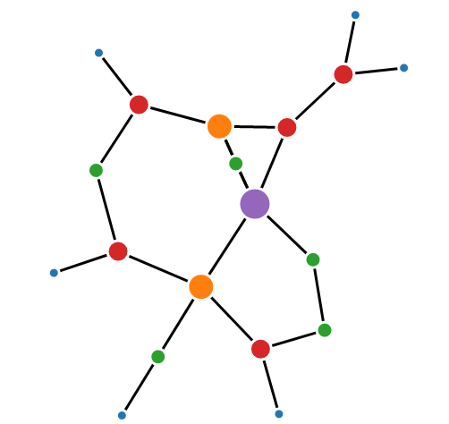
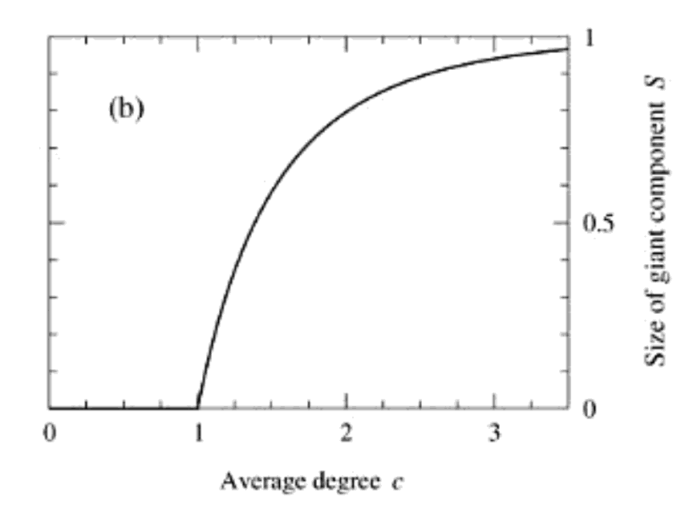

```{r xaringan-themer, include=FALSE, warning=FALSE}
#This block contains the theme configuration for the CSS lab slides style
library(xaringanthemer)
library(showtext)
style_mono_accent(
  base_color = "#5c5c5c",
  text_font_size = "1.5rem",
  header_font_google = google_font("Arial"),
  text_font_google   = google_font("Arial", "300", "300i"),
  code_font_google   = google_font("Fira Mono")
)
```

```{r setup, include=FALSE}
options(htmltools.dir.version = FALSE)
```

layout: true

<div class="my-footer"><span>David Garcia - Computational Modelling of Social Systems</span></div> 

---

# So far

**Block 1: Fundamentals of agent-based modelling**
  
- Basics of agent-based modelling: the micro-macro gap
- Modelling segregation: Schelling's model
- Modelling cultures

**Block 2: Opinion dynamics**
- Basics of spreading: Granovetter's threshold model
 - Exercise 1: Schelling's model and Pandas (session 2)
- **Today: Opinion dynamics**
  - Exercise 2: Threshold models (session 1)
- Modelling hyperpolarization and cognitive balance: Guest lecture by Simon Schweighofer (Webex)
  - Exercise 2: Threshold models (session 2) **Deadline: 20.04.2022**

---

# Overview

## 1. Random graphs

## 2. Poisson

## 3. Giant component

## 4. Null models

---

# Random graphs

## *1. Random graphs*

## 2. Poisson

## 3. Giant component

## 4. Null models

---

# Random graphs

- **Networks** that posses a particular property
  - Which are otherwise random (e.g., fixed degree distribution)

- **Analysis** performed by comparing (two) different model network structures
  - E.g., non scale-free networks vs. scale-free networks
  - Degree distribution: power law

```{r, echo=FALSE, out.width=450, fig.align='center'}

```

---

# Random graphs

- **Measurements** of network data for (two) different structures
  - Mathematically
  - Computationally
  - **Statistically**

- **Behavior** of such mathematical models of (two) different network structures
  - E.g. Dynamic processes on networks

---

# F.A.Q.

- Power law - explain

- Dynamic processes on a network

---

# Random graph ensamble

.pull-left[
```{r, echo=FALSE, out.width=900, fig.align='center'}

```
]

.pull-right[
- Consider a **simple graph** with the following fixed parameters:
  - Number of vertices (n)
  - Number of edges (m)

- For such **Random graph G(n,m)** created in the following method:
  - Place edge (m) between (uniformly) random chosen pair
  - Prevent multiedge/self-edge by:
  - Distinct pairing
  - Only to already not connected vertices
]

---

# Random graph ensamble

.pull-left[
- There is not one but an ensamble of networks that satisfy the fixed constraints
  - E.g., for n=20 and m=22

- Probability of such networks $P(G)$
  - $P(G)=\frac{1}{\omega}$ , for such networks where **$\omega$** is the number of such networks
  - $P(G)=0$ , for all other networks
]

.pull-right[
```{r, echo=FALSE, out.width=900, fig.align='center'}

```
]

---

# Random graph ensamble

- Segregated components are also possible

```{r, echo=FALSE, out.width=450, fig.align='center'}

```

---

# F.A.Q.

- Simple graph - show simple graph image from wiki

---

# Random graph ensamble

- Ensable have *typical* behavior based on **properties (averages)**
  - Diameter: $\langle l \rangle = \sum_{G} P(G)l(G) = \frac{1}{\omega} \sum_{G} l(G)$
  - Number of edges: $\langle m \rangle$
  - Degree: $\langle k \rangle = 2 \frac{m}{n}$

- Special cases on the spectrum of probability distributions are not important
  - E.g., large/small dimeter $l$
  - These are not *typical* networks
  - For large $n$ vertices properties averages tend to concentrate at the ensable averages

- Such **typical networks** can be analysed analytically

---

# Two interesting random graph ensambles

.pull-left[
- G(n,m) - given/fixed number of edges $m$
- G(n,p) - given/fixed probability of edges $p(m)$
  - The edges $m$ are not fixed
  - The vertices $n$ are fixed
  
- E.g., Erdos - Renyi model
]

.pull-right[
```{r, echo=FALSE, out.width=450, fig.align='center'}

```
]

---

# G(n,p) ensamble - $n$ fixed, $m$ not-fixed

- Probability of such G(n,p) networks $P(G)$:
  - $P(G) = p^m(1-p)^{(\frac{n}{2})-m}$ , for such networks
  - $P(G)=0$ , for non-simple graphs

.pull-left[
- p = 0.1

```{r, echo=FALSE, out.width=300, fig.align='center'}
knitr::include_graphics("Figures/g_n_p_0_1.png")
```
]
.pull-right[
- p = 0.05

```{r, echo=FALSE, out.width=300, fig.align='center'}

```
]

---

# Analytical behavior analysis of G(n,p) ensamble - $n$ fixed, $m$ not-fixed

- Mean number of edges $\langle m \rangle$
  - **Distinct vertex pairs** $\binom{n}{2}$ * probability of an edge $p$;

$$\langle m \rangle = \binom{n}{2} p$$
- Mean degree of vertex $\langle k \rangle$ also as $c$
  - Number of other vertices $(n-1)$ * probability of an edge $p$

$$\langle k \rangle = (n-1)p$$

---

- Degree distribution $p_{k}$ (for a vertex connected with $k$ others)
  - **Distinct vertex pairs** $\binom{n-1}{k}$ * probability of connection with $k$ vertices, but not with others

$$p_{k} = \binom{n-1}{k}p^{k}(1-p)^{n-1-k}$$

---

# Example G(n,p) ensamble - $n$ fixed, $m$ not-fixed

.pull-left[
- n = 20, p = 0.1 = $C$
- $\langle m \rangle = 190 * 0.1 = 19$
- $\langle k \rangle = (20-1) * 0.1 = 1.9$
- $p_{3} = 969 * 0.001 * 0.185 = 0.18$

```{r, echo=FALSE, out.width=300, fig.align='center'}
knitr::include_graphics("Figures/g_n_p_0_1.png")
```
]
.pull-right[
- n=20, p = 0.05 = $C$
- $\langle m \rangle = 190 * 0.05 = 9.5$
- $\langle k \rangle = (20-1) * 0.05 = 0.95$
- $p_{3} = 969 * 0.000125 * 0.44 = 0.05$

```{r, echo=FALSE, out.width=300, fig.align='center'}

```
]

---

# F.A.Q.

- Binomial distribution

---

# Random graphs

## 1. Random graphs

## *2. Poisson*

## 3. Giant component

## 4. Null models

---

# Poisson random graph: special case of G(n,p) ensamble for large networks $n\rightarrow\infty$

- Mean degree $c$
  - Constant over large networks - number of friends does not depend on the number of people in the world $c = (n-1)p \Rightarrow p = \frac{c}{n-1}$ , $n\rightarrow\infty$
  - Vanishingly small probability $p$ of an edge
    
- Degree distribution (for a vertex) $p_k$

$$p_{k} = e^{-c} \frac{c^{k}}{k!}, n\rightarrow\infty$$

---

# F.A.Q.

- Assymptotically equalt to as some value aproaches the limit

---

# Analytical behavor analysis of G(n,p) ensamble - $n$ fixed, $m$ not-fixed

- Clusering coefficient $C$
  - Transitive behavior (property) in a network
   - What is the probability that two vertex neighbours are also neighbous of each other?

$$C = \frac{c}{n-1}$$
- Poisson random graph: special case of G(n,p) ensamble for large networks $n\rightarrow\infty$
  - Clustering coefficient $C \simeq 0 , n\rightarrow\infty$, if mean degree $c$ is fixed
  - Difference between the RNG and real-world networks: real-world networks have high clustering coefficient $C$
---

# Example Poisson vs. real-world network

.pull-left[
```{r, echo=FALSE, out.width=600, fig.align='center'}

```
]
.pull-right[
```{r, echo=FALSE, out.width=600, fig.align='center'}

```
]

---

# Random graphs

## 1. Random graphs

## 2. Poisson

## 3. *Giant component*

## 4. Null models

---

# Largest component for large networks $n\rightarrow\infty$

- If $p = 0$; independent of size $n$
  - Disconnected network
  - $n$ separate components - vertices isolated
- If $p = 1$; dependent of size $n$
  - 1-single component
  - Each vertex is connected to each other
  - **Giant component**
- Most networks (should) have a large component that fills the network (to be able to perform the intended role)
  - e.g., Internet connected component (infrastructure)

---

# Sensitivity of parameter $p[0,1]$ vs. largest component
- How the size to the largest component changes in respect to $p$?
  - Expected: The size increases gradually and it is **extensive** around $p = 1$
  - Reality: Largest componenet suddenly changes for one particular value of $p$
  - **Phase transition**

---

# Analytical behavor analysis of G(n,p) ensamble for large networks $n\rightarrow\infty$

.pull-left[
```{r, echo=FALSE, out.width=600, fig.align='center'}

```
]

.pull-right[
1. Size $S=0$; small $c$ - no giant component

2. Size $S=0$ and $S>0$ ; large c - there is giant component
  - Transition phase happendes in between small/large $c$, where gradient of the diagonal matches the gradient of the curve for $S=0$
]

---

# What is the size of the giant component?

.pull-left[
```{r, echo=FALSE, out.width=600, fig.align='center'}

```
]

.pull-right[
- Size of the giant component for $c>1$ is larger than 1. Solution $S=0$
  - This is illustrated on Fig 12.1 for all values of c, with limit at $c=1$ for two given cases
]

---

# Excercise 7

- Show alreday given models that show phase transition, Schelling, Granovetter

---

# Random graphs

## 1. Random graphs

## 2. Poisson

## 3. Giant component

## 4. *Null models*

---

# Random graphs as null models

- Most real-world networks show an average distance which is comparable to that of the corresponding random graph
  - Their average clustering coefficient is much higher

- Exploratory data analysis
  - Given the value of a structural measure in a real-world network it can be compared with the expected value of that measure in a graph in which the network’s structure is randomized
  - Any structure is tested whether it deviates from the structure of some pre-defined model

- In terms of statistics, the null-hypothesis assumes that graph G ∈ S was produced by the random graph model
  - This null-hypothesis is rejected if it is very unlikely that the model is true
  - The random graph model is also often called **the null model** 
  
- the p-value $P(G|\mathcal{G})$ itself, i.e., the probability that the observed graph $G$ was produced by some random graph model $\mathcal{G}$, does not directly give you the probability $P(\mathcal{G}|G$, i.e., the probability that the model is true when $G$ is observed
  - **Strawmen argument**
  
---

# Social network example

```{r, echo=FALSE, out.width=300, fig.align='center'}

```

- Increasing complexity, cliquishness and gender segregation with age.
  - Filled squares, girls; open circles, boys.

- It is well known that, in general, same-gender friendships are more likely than boy-girl friendships— especially in primary school. 

- Conlan et al. compared the number of these edges with the expected one in a model where each child maintains the number of declared and received friendship declarations with respect to the gender of the other child. 
  - The mutuality is still statistically significant in almost all cases
  - The effect is less pronounced than if compared with a simple directed random graph in which the gender is not regarded. 
  - *Note that this can be modeled structurally by defining two different indegrees and two different outdegrees, each differentiated by the gender of the other child. The random graph model then maintains both types of in- and outdegrees.*

---

# Strawman argument

- In conducting any statistical test there are two hypotheses being considered
  - The hypothesis that the researcher is really interested in is called the alternative (or sometimes the "experimental") hypothesis (or H1)
  - The other is called the null hypothesis (or H0)
  - The null hypothesis is a kind of "strawman"; it's a hypothesis that we want to disprove
  - The reason for all this is that the great scientific philosophers (like Karl Popper) argue that we cannot logically prove something to be true, we can only disprove it (we create hypotheses that are falsifiable)
  -  When we compare two group means, for instance, the null hypothesis states that they are equal to one another. The alternative then is that they are unequal, and if we wind up disproving or rejecting the null hypothesis, that is what we will conclude.

- E.g., the null hypothesis would state that the a particular sample average is not significantly different from the population value
  - It is different only due to chance factors. In other words, the sample mean is not really any different from the population mean once we take into account sampling variability
  - If the null is not true, we accept the alternative hypothesis, that the sample mean is not equal to the population mean
  - To "accept" the alternative hypothesis. Technically, we can't prove that it is true, so we just retain it until it is proven wrong

# Strawmen arguemnt example

- The problem is that the two conditional probabilities assume different reference groups and so they don’t even address the same research question.
  - Another way of saying this is that a researcher cannot use the probability of a person being Catholic given that he’s the Pope to answer the question of whether someone is the Pope given that he’s Catholic
  - Another example of this fallacy is to suggest that because many terrorists have backgrounds in engineering, engineers are more likely to be terrorists. 
